# Ride accept predictor

## 0. Context & problem definition

This project aimed for building a predictive algorithm that decides whether a driver registered to provide rides for customers of a mobile ride-hailing app and who is requested to take a ride offer, is going to eventually accept that offer or not. Assuming nearby drivers are available, the backend of the app sends a booking requests to a driver, who can accept or declinethe ride. If the driver declines, the app can query one or more extra drivers (under certain conditions), therefore issuing more booking requests for the same ride request.

Due to the time constraint (10 hours) the aim was to create a model of reasonable prediction quality (minimum viable product - MVP - approach) driven by a few engineered features. Assuming this project was real data science prject in the industry, a subsequent step would be acquiring deeper domain knowledge about ride-hailing transportation especially regarding the dynamics and influencing factors of time and location-dependent supply and demand of both drivers and ride hailing customers alike which would support creating features of even better predictive quality.


image source: [link](https://www.flickr.com/photos/beyonddc/33035757163)

## 1. Data

The dataset cointained 3 simplified log files representing 24hr worth of various data. The raw data must remain confidental.

### **rideRequests.log**

Each line represents a user requesting a ride from a pickup location to an arrival
location.

* `ride_id` : each ride request is assigned a unique identifier
* `created_at` : the epoch when this log entry was appended
* `origin_lat` and `origin_lon` : the pickup location
* `destination_lat` and `destination_lon` : the arrival location

### **bookingRequests.log**

Each line represents an attempt to offer a given ride to a given driver.

* `request_id` : each booking request is assigned a unique identifier
* `logged_at` : the epoch when this log entry was appended
* `ride_id` : each booking request is linked to a user-iniated ride request (see 1.)
* `driver_id` : each booking request is sent to a given driver (see 3.)
* `driver_accepted` : the driver's response (boolean)
* `driver_lat` and `driver_lon` : the location of the driver at the time the booking request was dispatched

### **drivers.log**

Each line represents a driver state change.

* `driver_id` : each driver is assigned a unique identifier
* `logged_at` : the epoch when this log entry was appended
* `new_state` : the driver's state, which can be one of
* `{ connected , disconnected , began_ride , ended_ride }`

## 2. Analysis

Due to time constraints for this project I aimed for finding a balance between the aspects of data exploration, feature engineering, modeling and interpretation of the results. During the project several ideas came up regarding how to expand and branch off the project within these various analysis steps and add several more.

Upon inspecting the data and convincing myself of the cleanliness of the data, the decision was made (with respect to the goal of the project) to left join the `bookingRequest` table with the `rideRequest` table on the `ride_id` column and the resulting DataFrame `df_rides` underwent a data inspection and EDA in Pandas.

### 2.1. Data inspection & exploration

The first task consisted of inspecting the three logfiles and getting an overview of the joined dataframe `df_rides` and the meaning of the data (see chapter **1. Data**). Several things were apparent:

* the three log files contained data roughly spanning over a timeframe of the same 24 hours:

  log file name | timestamp start | timestamp finish
  ---|---|---
  rideRequests.log | 2018-10-29 12:04:50.650768640 | 2018-10-30 11:53:58.996917504
  bookingRequests.log | 2018-10-29 12:04:49.561193728 | 2018-10-30 11:53:58.996917504
  drivers.log | 2018-10-29 12:00:01.116698112 | 2018-10-30 11:54:29.890972416

* I gained a rough overview of the distribution of the numerical data. It could be concluded that the geographical coordinates are perfectly normal distributed (most likely artificially generated) roughly around the city center of a big European city. A quick plot with Folium (not contained in the notebook because of limited memory on github) confirmed this.
Furthermore, the target variable `driver_accepted` is imbalanced, which made a sampling technique necessary before model training.

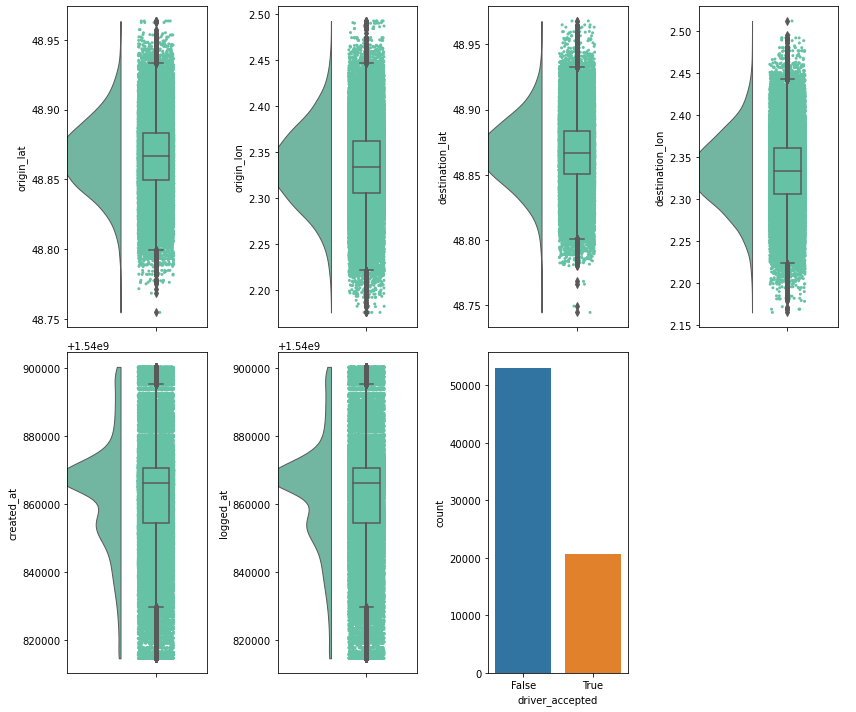

* the cleanliness of the data was assessed. There were no missing values. No inference of missing values was necessary. Also statistical outliers are hardly present / wouldn't impact the prediction here.

### 2.2. Feature engineering

Several features were engineered or can be engineered in the future which contributed to the predictive power of the model with respect to if a driver accepts a ride. For each a function was written which conveniently could be used in a preprocessing pipeline to build up the ML ready dataframe.

#### 2.2.1 Geographical distances between rider, driver and destination (implemented)

A driver might me influenced in her decision to accept a request by either one or a combination of these distances:

* his/her distance to the rider (or **origin**) - will be called `driver_origin_distance`
* rider's (or **origin's**) distance to the destination - will be called `origin_destination_distance`
* drivers distance to the destination - will be called `driver_destination_distance`

In the following I created three scatterplots containing every booking request issued and how they are distributed over the three above mentioned distances as well as over time. They are additionally hued depending on `driver_accepted`  

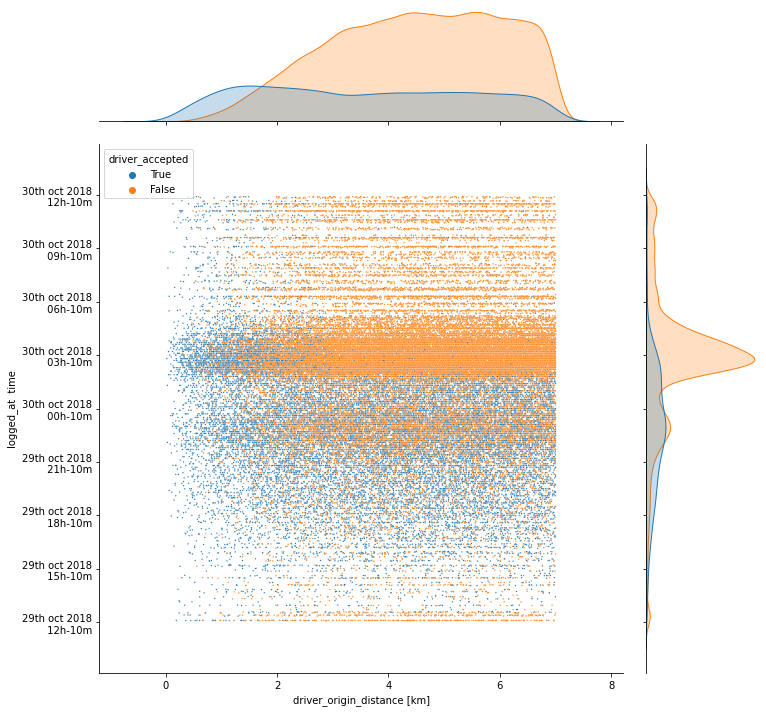
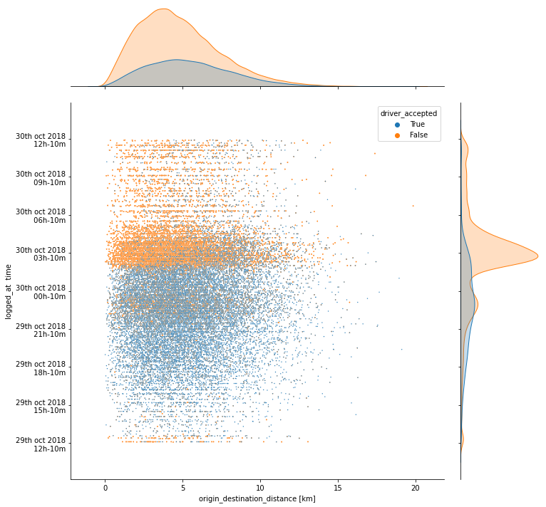
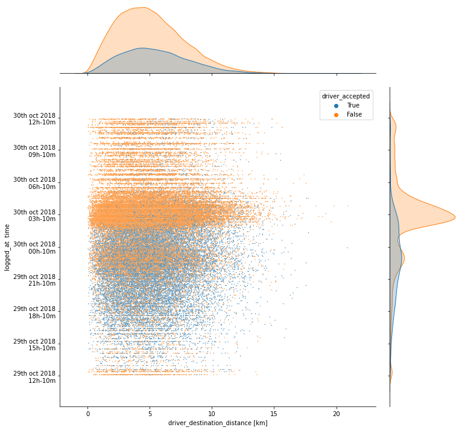

One can identify overweights of `driver_accept=False` in certain time periods (around 3am e.g.) for all three kinds of distances and as well as an distinctive overweight of `driver_accept=False` towards higher distances of driver-origin (first plot). This way one can indeed immediately get an idea of the importance of at least the `logget_at` and the `driver_origin_distance` feature to be important predictors for the target variable.

#### 2.2.2. How far away from the city center is the request / the destination? (not yet implemented)

One can conclude from the geographical normal distribution of request data that most rides are requested within the city center. A drivers preference regarding which rides to accept might be influenced by the assumption where most rides are requested since this allegedly would increase his/her chances to catch the next request after dropping off the customer /rider in quick succession - increasing his/her daily profit.

Since we saw that all geographic coordinates are almost perfectly normally distributed, we assume that the mean of it corresponds to the city center. In a case of a city which shows a high degree of point symmetry like Paris one also could choose the city center as a reference point for this feature.

**A more sophisticated approach for real world data** would probably be to cluster the multitude of geographic coordinates of all ride requests of the past with an unsupervised algorithm e.g. K-Means, build not only one but multiple cluster centers (which would correspond roughly to more "vivid" or more densely populated areas) and then calculate for every ride request the distance between the rider and the next cluster. The idea being that the closer to one of the vivid areas a rider requests a ride, the earlier the requested driver hopes to finish the ride also within that area and pick up the next rider in quicker succession increasing his/her acceptance level. An assumed behavior of drivers could therefore be to stick around in the vicinity of venues, places of active nightlife etc.

#### 2.2.3. Time difference between ride request made and booking request made (implemented, doesn't play a role)

A driver might expect a more displeased (pleased) rider if too much (only little) time has passed since the request was made, risking a negative (hoping for a positive) review. Therefore - as it was the initial though - this time difference could be of importance. It was discovered only after analyzing the feature importance of the trained model that this feature does hardly play a role, since the system seems to issue booking request almost **immediately** after ride request, and only in very rare cases couple of seconds pass between these events.

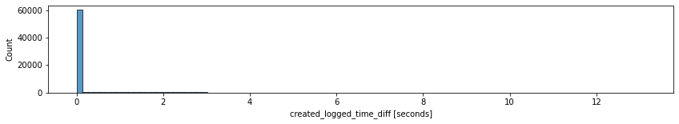

#### 2.2.4. How many rides has a driver completed since last 'connected' when booking request is issued (implemented)

A driver might be more inclined to accept a booking request when having completed only few rides / less inclined when already completed subjectively enough. This theory is also motivated by some visualizations done in the EDA process. To engineer this feature, the joined `bookingRequest` and `rideRequest` table was combined with the `drivers` table: For each individual row of that joined table `df_rides`, the `driver_id` together with the `logged_at` epoch was used to 1) group the `driver` table by that `driver_id` and then sum up how many cases of `ended_ride` states occured up to that `logged_at` epoch. This sum was appended as another column `no_of_accumulated_rides` to the main `df_rides` DataFrame.


 In the below scatterplots (*fig. 1 - 3*) all booking requests are plotted with the number of accumulated rides the specific driver has accumulated up to that point when the booking request is issued (x-axis) and distances (rider-driver, rider-destination, driver-destination). It is clearly visible that riders are more inclined to accept when they don't have much rides accumulated. Additionally *fig. 3* in particular shows that drivers who get requested between roughly their their 2nd to 5th ride of their "shift" accept a broad range of distances to the customer, while above the 5th - and in particular as their first ride they tend to reject long distances.

It can be really beneficial to analyze these plots more in depth which can provide promising leads for even more features.

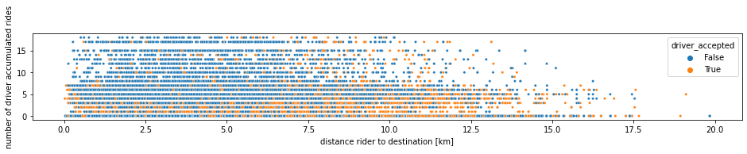
(fig. 1)

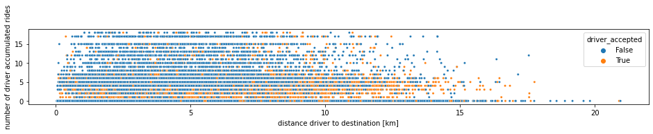
(fig. 2)

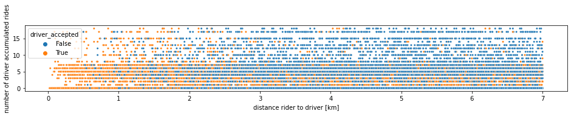
(fig. 3)

#### 2.2.5. Accumulated distance that a driver has travelled since last 'connected' when booking request is issued (not yet implemented)

A driver might be less inclined to accept a new booking the longer the accumulated distance is on his/her workday.

#### 2.2.6. `is_in_ride` (implemented, but omitted)

Another crucial feature for the target variable could be if a driver is finding himself/herself in a ride with a customer when a new booking request arrives.

It was found and confirmed though that booking requests are only issued to those drivers who are connected and free. Therefore this feature wouldn't have any predictive power and wasn't implemented.

### 2.3. Model building

A baseline model (logistic regression) with `df_rides` was quickly build with no preprocessing or feature engineering whatsoever. Expectedly it performed poorly in predicting the underbalanced class (`driver_accepted=True`).

I therefore switched to training a **Random Forest** model, after using SMOTE (synthetic minority oversampling) on the imbalanced target variable and after adding the aforementioned engineered features to the already existing ones.

I only optimized the RandomForest with regards to the number of trees (result ca. n=150) using a GridSearch with 10-fold cross validation with accuracy score as scoring paramenter

### 2.4. Model results

Looking at the metrics, the confusion matrices, the ROC curve and the AUC one can say that the model does a decent job in minimizing the False Positives and False Negatives.

When assessing model quality according to several metrics one should always keep in mind though the big picture - in this case *what are the costs when misclassifying* the target variable in certain directions, e.g.

* goal 1: Minimizing the chance of missing `driver_accept=True` cases (with the idea that we can allow for some drivers classified that they would accept). In this case our model would perform reasonably well with a **recall** of 0.84. In practical terms, from this classification results recommendations could be send out to the drivers to deploy in certain areas, this could lead to the system recommending more drivers to move to certain locations "for nothing" (because the system decided they might accept specific rides there). If the cost of this is acceptable to our business, this trained model would already be a decent one.

* goal 2: Minimizing the number of drivers who are wrongly predicted as accepting a drive (FP's). A benefit that could be bought by allowing for more drivers to be classified that they would not accept a drive - although they would. In this case our model's **precision** of 0.65 would perform relatively bad compared to the other metrics.

class |precision|recall|f1-score
---|---|---|---
`driver_accept=False`|0.93|0.82|0.87
`driver_accept=True` |0.65|0.84|0.73

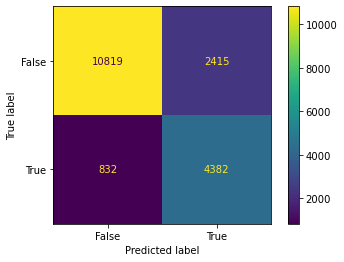|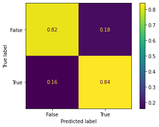
--|--
confusion matrix with absolute values of classification| confusion matrix with values normed to the true label

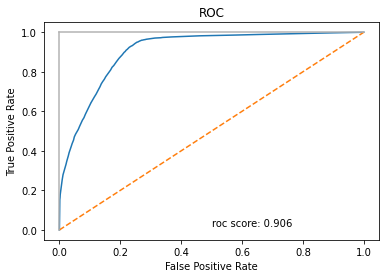


**Feature importance**

Below the feature importances are shown which were calculated during the model training and can be accessed via the `feature_importances_` property of the model. Interestingly (but also not surprisingly) the engineered feature of the distance between driver and customer at the time when the booking request is issued is the most important one. Other three engineered features like `òrigin_destination_distance`, `no_of_accumulated_rides` and `driver_destination_distance` rank rather high and provide predictive power. The engineered time difference between ride request and booking request does hardly play a role - no wonder: After inspecting the histogram of these values it's clear: The system issues booking requests almost immediately after ride requests.


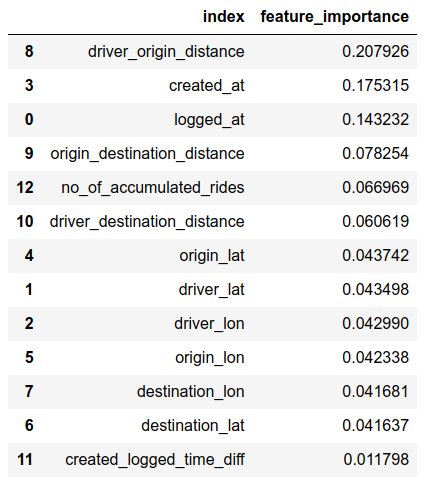


<!---
# X. Outlook

## ToDo

* Modularize functions (especially feature generation)

## Data

* for real world data which span multiple days, temporal features like `is_weekend`, `is_workday`, `is_holiday` etc. could be engineered

## ML

* Use more sophisticated sampling methods (combined over- and undersampling)
* Try Logistic Regression


## 3. Usage

To run this notebook, install the necessary packages listed either in the `requirements_conda.txt` (if your run it in a conda environment) or `requirements_pip.txt` (if installation via pip).

For conda, do
```bash
conda create --name <env> --file requirements_conda.txt
```

for pip, do
```bash
python3 -m venv env
source env/bin/activate
pip install -r requirements_pip.txt
```

--->
